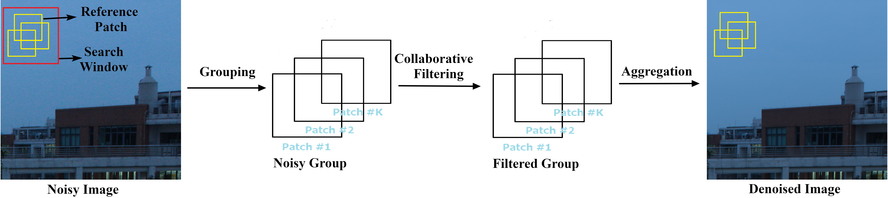

# A Comparison of Image Denoising Methods
Zhaoming Kong, Fangxi Deng, Haomin Zhuang, Xiaowei Yang, Jun Yu, Lifang He

## Overview
In this project, we intend to collect and compare various denoising methods to investigate their effectiveness, efficiency, applicability
and generalization ability with both synthetic and real-world experiments. Datasets, code and results are made publicly available
and will be continuously updated. To gain access to the dataset and the code, please send me an email (kong.zm@mail.scut.edu.cn) with information including name, position and usage. 

## Compared methods
The interest in the realm of denoising grows consistently with a large quantity of approaches, which may be roughly divided into two categories, namely traditional denoisers and DNN methods, depending on whether neural network architectures are utilized.

### Traditional denoisers
For traditional denoisers, learning and denoising are usually accomplished only with the noisy image by leveraging the NLSS property. To achieve this goal, the most popular and successful framework is attributed to BM3D, which mainly follows three consecutive stages: grouping, collaborative filtering and aggregation. The flowchart of this effective three-stage paradigm is illustrated in the following Figure.

* Image denoising (sRGB space).

* Video denoising (sRGB space).

* MSI/HSI denoising.

* 3D MRI denoising.

