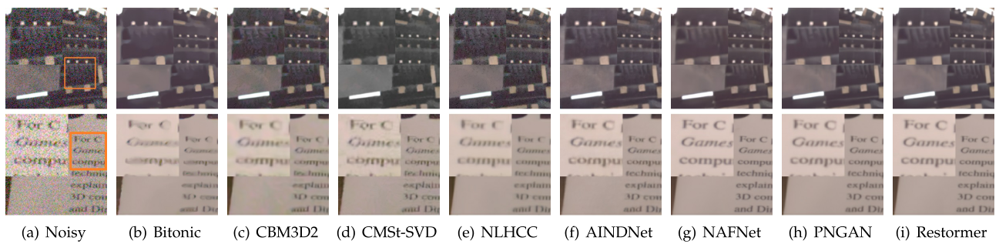
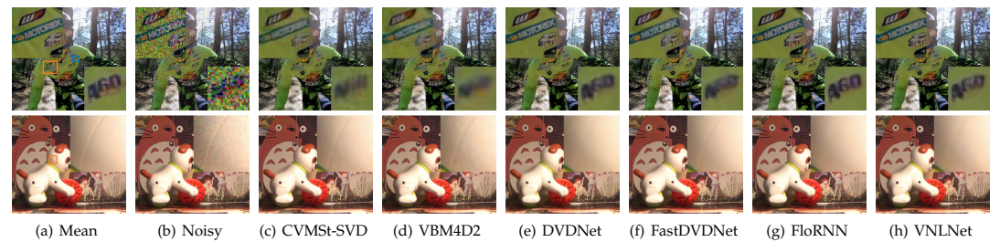
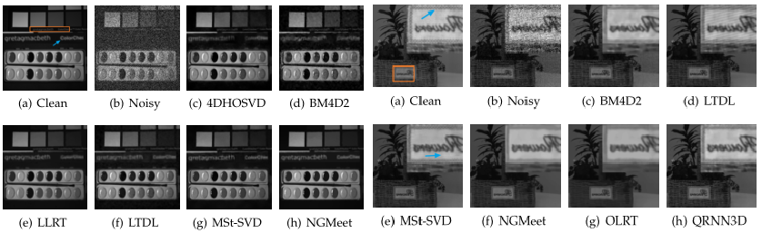
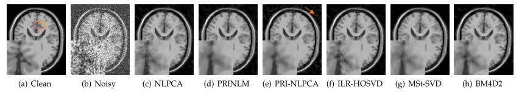

# A Comparison of Image Denoising Methods
Zhaoming Kong, Fangxi Deng, Haomin Zhuang, Xiaowei Yang, Jun Yu, Lifang He

## Overview
In this project, we intend to collect and compare various denoising methods to investigate their effectiveness, efficiency, applicability
and generalization ability with both synthetic and real-world experiments. Datasets, code and results are made publicly available
and will be continuously updated. To gain access to the dataset and the code, please send me an email (kong.zm@mail.scut.edu.cn) with information including name, position and usage. 

* Image denoising (sRGB space).

* Video denoising (sRGB space).

* MSI/HSI denoising.

* 3D MRI denoising.

