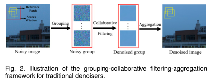
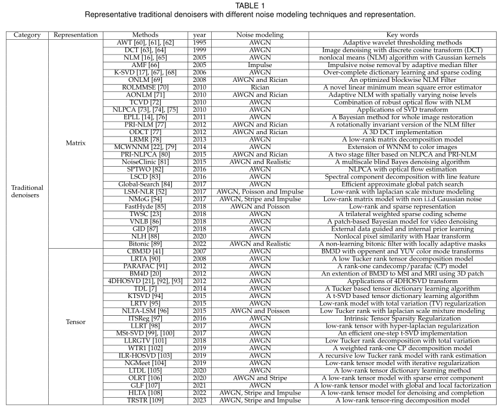
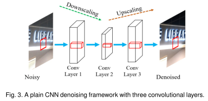
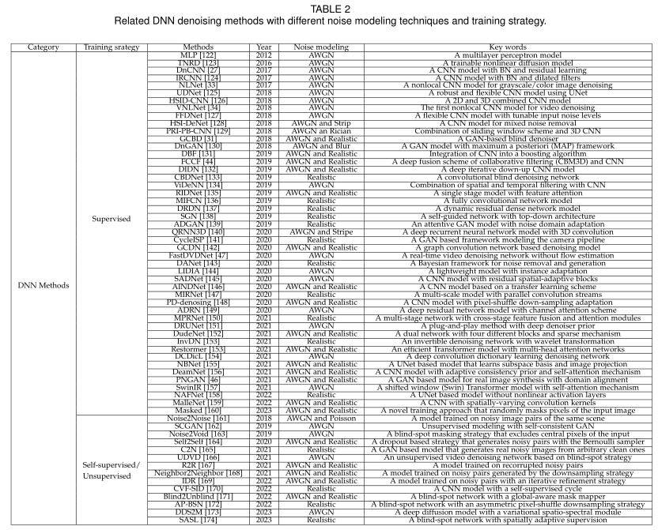

# A Comparison of Image Denoising Methods (Updated: 2023/05/06)
Zhaoming Kong (kong.zm@mail.scut.edu.cn), Fangxi Deng, Haomin Zhuang, Jun Yu, Lifang He and Xiaowei Yang

* [Manuscript](http://arxiv.org/abs/2304.08990)
* [Supplementary Material](https://github.com/ZhaomingKong/Denoising-Comparison/blob/938179b44afbd2fd8506ef3b5274f31606e3cc44/Supplementary%20Material.pdf)
* [Dataset](https://drive.google.com/drive/folders/1QpgusTtgXvUGoZKzTguDSrOrNhFD-M_v?usp=share_link)

If you do not have access to Google services, please contact me.

## Overview
In this project, we intend to collect and compare various denoising methods to investigate their effectiveness, efficiency, applicability
and generalization ability with both synthetic and real-world experiments. Datasets, code and results are made publicly available
and will be continuously updated. To gain access to the dataset and the code, please send me an email (kong.zm@mail.scut.edu.cn) with information including name, position and usage. 

## Compared methods
The interest in the realm of denoising grows consistently with a large quantity of approaches, which may be roughly divided into two categories, namely traditional denoisers and DNN methods, depending on whether neural network architectures are utilized.

### Traditional denoisers
For traditional denoisers, learning and denoising are usually accomplished only with the noisy image by leveraging the NLSS property. To achieve this goal, the most popular and successful framework is attributed to BM3D, which mainly follows three consecutive stages: grouping, collaborative filtering and aggregation. The flowchart of this effective three-stage paradigm is illustrated in the following Figure.

Since the birth of BM3D, there is no shortage of extensions originating from different disciplines. Some representative traditional denoisers are summarized in the following Table.

 Representative traditional denoisers (click here)

  

### Deep neural network (DNN) methods
The most recent development of image processing stems largely from the applications of deep learning techniques, which demonstrate outstanding performance in a wide variety of tasks. Image denoising is not an exception. From the early plain networks to recently proposed generative and diffusion models, numerous net- work architectures and frameworks have been developed with different training strategies, including supervised, self-supervised and unsupervised learning. The following figure illustrates a simple DNN denoising framework with three convolutional layers.

Since the birth of BM3D, there is no shortage of extensions originating from different disciplines. Some representative traditional denoisers are summarized in the following Table.

 Related DNN methods (click here)

  

## Datasets

******************************** Update 1.0 ***************************************  
Images using new camera brands (Canon 100D and Sony A6500) are uploaded 7/18/2018 Thank you Zhuoyun Zheng and Ayi for sharing your cameras.

******************************** Update 2.0 ***************************************  
Photos taken by OPPO R11s are uploaded 1/24/2019. Thank you Haoxue Yang for sharing your camera.

******************************** Update 3.0 ***************************************  
Photos taken by XIAOMI8 (DXOMARK 103) are uploaded 2/5/2019. Happy Chinese New Year.

******************************** Update 4.0 *************************************** 
The dataset is uploaded to googledrive. Feel free to contact me for share link.
******************************** Update 4.0 *************************************** 

******************************** Update 5.0 ***************************************  
Photos taken by Fujifilm X100T are uploaded 6/28/2020. Keep healthy and stay at home.

******************************** Update 6.0 ***************************************  
Photos taken by NIKON D5300 are uploaded 11/08/2020. Keep healthy and stay at home. Thank you Shusen Jing for sharing your camera.

******************************** Update 7.0 ***************************************  
Photos taken by HUAWEI Mate40Pro are uploaded 04/08/2022. The image quality is amazing.

******************************** Update 8.0 ***************************************  
Photos taken by IPHONE13 are uploaded 05/08/2022. Lets go Warriors!

## Experiments

* Image denoising (sRGB space).

* Video denoising (sRGB space).

* MSI/HSI denoising.

* 3D MRI denoising.

